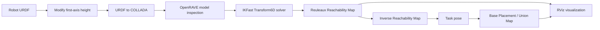

# Bots2Rec Reachability & Base Placement Analysis

[](https://github.com/ChanYanxin/bots2rec-reachability-analysis/actions/workflows/ci.yml)

Portfolio reconstruction of my Bachelor's thesis project at the Institute of Mechanism Theory, Machine Dynamics and Robotics (IGMR), RWTH Aachen University.

The project studies how a **7-DOF mobile manipulator** can be adapted for semi-autonomous ship-recycling tasks by changing the height of the first rotational axis and evaluating the effect on:

- robot workspace and reachability,
- redundancy handling in analytical inverse kinematics,
- inverse reachability,
- task-specific mobile-base placement.

> **Scope note:** this repository documents and engineers the analysis workflow and experimental results. Original institute robot geometry/CAD assets and third-party source trees are intentionally not redistributed here.

## Problem

The Bots2Rec platform was originally designed for overhead asbestos-removal tasks. In the SHEREC ship-recycling scenario, the manipulator also has to reach cutting targets below the wheel/deck plane. The thesis therefore investigated whether a small mechanical modification — lowering the first rotational axis — could improve task-specific reachability while preserving useful base-placement options.

## Experimental configurations

| Configuration | First-axis offset |
|---|---:|
| Baseline | 0.0 m |
| Variant A | -0.2 m |
| Variant B | -0.5 m |
| Variant C | -0.8 m |

The robot arm is kinematically redundant (7 revolute joints for a 6D end-effector pose). Multiple IKFast free-joint configurations were evaluated, with **freeindex = 4 (Joint 5, zero-based index)** selected as the primary configuration for the controlled comparison.

## Analysis pipeline



The original analysis used a legacy ROS/OpenRAVE stack:

- Ubuntu 14.04
- ROS Indigo
- OpenRAVE / IKFast
- Reuleaux
- RViz
- MoveIt IKFast utilities for COLLADA preparation

This repository keeps the historical workflow explicit instead of pretending the original environment is a modern, turnkey installation.

## Key parameters

- IK type: `Transform6D`
- OpenRAVE base-link index: `0`
- OpenRAVE end-effector link index: `12`
- Primary free index: `4`
- Reuleaux reachability-map resolution: `0.09 m`
- Ship-cutting task pose used for base-placement study:
  - position: `x=0, y=0, z=-0.7 m`
  - orientation: `roll=240°, pitch=0°, yaw=30°`

See [`configs/experiment.yaml`](configs/experiment.yaml) and [`configs/task_pose.yaml`](configs/task_pose.yaml).

## Main findings

The generated reachability maps showed a clear shift of useful workspace toward lower regions as the first rotational axis was lowered. The -0.5 m and -0.8 m configurations provided substantially better reachability below the wheel plane than the baseline.

The study also exposed an important trade-off: better low-level reachability did **not** automatically imply better base-placement flexibility. For the selected task pose, lowering the axis reduced the feasible base-placement region, and the most aggressive geometry change also produced fewer IK solutions for some redundant-joint settings.

A second practical finding was that a single free-joint configuration does not fully represent the workspace of a redundant manipulator. Composite maps across feasible free-index settings provide a more complete view of the robot's reachable space.

## Repository structure

```text
.
├── .github/workflows/       # Lightweight repository validation
├── configs/                 # Experiment and task-pose parameters
├── docs/                    # Methodology, IKFast workflow, experiment notes
├── scripts/                 # Reproduction helpers for the legacy toolchain
├── results/                 # Result documentation (no institute-only raw assets)
├── .gitignore
├── LICENSE
├── THIRD_PARTY.md
└── README.md
```

## Reproducing the workflow

This is a reconstruction of a 2024 research workflow built on software that is now largely legacy. The helper scripts in this repository are **documentation-oriented**: they encode the original sequence of operations and expected parameters, but they have not been validated as a one-command setup on current Linux/ROS distributions.

Start with:

1. [`docs/methodology.md`](docs/methodology.md)
2. [`docs/ikfast_workflow.md`](docs/ikfast_workflow.md)
3. [`docs/experiment_design.md`](docs/experiment_design.md)
4. [`docs/results.md`](docs/results.md)

## CI scope

The GitHub Actions workflow checks shell syntax, parses the YAML experiment files, and confirms that the key documentation is present. It intentionally **does not** claim to reproduce or build the historical ROS Indigo/OpenRAVE stack.

## External tools and references

- Reuleaux: http://wiki.ros.org/reuleaux
- Reuleaux source: https://github.com/ros-industrial-attic/reuleaux
- Reuleaux Base Placement Plugin: http://wiki.ros.org/reuleaux#Base_Placement_Plugin
- MoveIt IKFast tutorial: https://decyzy.github.io/moveit_tutorials/doc/ikfast/ikfast_tutorial.html
- OpenRAVE documentation: http://openrave.org/docs/latest_stable/

## Authorship

**Yanxin Chen**

Bachelor's thesis project, RWTH Aachen University, 2024.

The repository contains a cleaned, portfolio-oriented reconstruction of the author's analysis workflow. Third-party software remains subject to its original licenses.